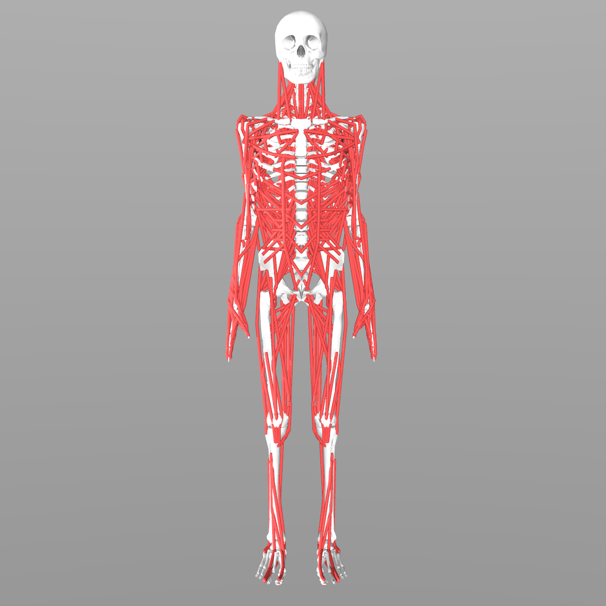
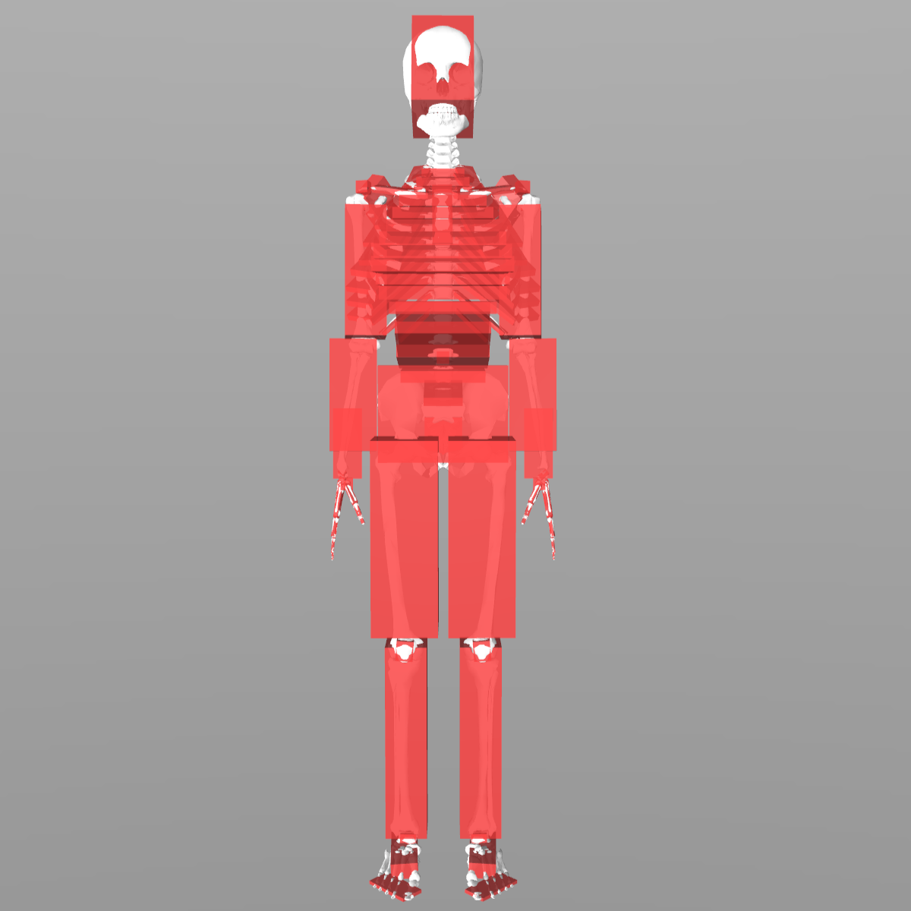

# MS-Human-700: Whole-body Human MusculoSkeletal Model

Self model for embodied intelligence: Modeling full-body human musculoskeletal system and locomotion control with hierarchical low-dimensional representation (ICRA 2024)

## Overview

This repository contains a comprehensive framework for MS-Human-700 modeling and simulation using MuJoCo physics engine. MS-Human-700 model represents the full-body human musculoskeletal system, with anatomically-detailed body, joint, and muscle parameters referring to the biomechanical literature. It includes 700 (or more) muscle-tendon units. For the detailed modeling and control methods, please refer to the [ICRA 2024 paper](https://arxiv.org/abs/2312.05473), the [ICML 2024 paper](https://arxiv.org/abs/2407.11472), and the [ICLR 2025 paper](https://arxiv.org/pdf/2505.08238).

<div align="center">
  
  
</div>

<div align="center">
  
  
</div>

## Installation

Clone this repo and training submodules, create a new conda environment and install dependencies:

```
git clone --recurse-submodules https://github.com/LNSGroup/MS-Human-700-Release.git
cd MS-Human-700-Release
conda create -n "mshuman" python=3.9
conda activate mshuman
pip install -e .
```

### Optional Dependencies

- For DynSyn-SAC reinforcement learning training:
```
pip install -e ".[dynsyn]"
```

## Simulation Environments

Run the test script to interact with MS-Human-700 models in simulation environments:

```
python environments/env_test.py -loco 
python environments/env_test.py -mani 
```

> **Note**: The visualization requires a display device (monitor). If running on a headless server or without display access:
> 1. Change the render mode in `environments/env_test.py` from `human` to `rgb_array`
> 2. Set environment variable: `$env:MUJOCO_GL="egl"` for offscreen rendering

```
MUJOCO_GL=egl python environments/env_test.py -loco --render_mode "rgb_array"
MUJOCO_GL=egl python environments/env_test.py -mani --render_mode "rgb_array"
```

## Training

You can train controllers to actuate MS-Human-700 models in simulation environments by DynSyn-SAC algorithm.

Training: 

```
cd agents/DynSyn-SAC
CUDA_VISIBLE_DEVICES=0 MUJOCO_GL=egl python SB3-Scripts/train.py -f PATH_TO_CONFIG_FILE
```

Evaluation:

```
cd agents/DynSyn-SAC
CUDA_VISIBLE_DEVICES=0 MUJOCO_GL=egl python SB3-Scripts/eval.py -f PATH_TO_LOG_DICT
```

You can download the trained checkpoints from the GitHub Releases to reproduce the results.

## License

This model is released under an [Apache-2.0 License](LICENSE).

## Citation

If you use this work in an academic context, please cite the following publication:

```bibtex
@inproceedings{zuo2024self,
  title={Self model for embodied intelligence: Modeling full-body human musculoskeletal system and locomotion control with hierarchical low-dimensional representation},
  author={Zuo, Chenhui and He, Kaibo and Shao, Jing and Sui, Yanan},
  booktitle={2024 IEEE International Conference on Robotics and Automation (ICRA)},
  pages={13062--13069},
  year={2024},
  organization={IEEE}
}
```
